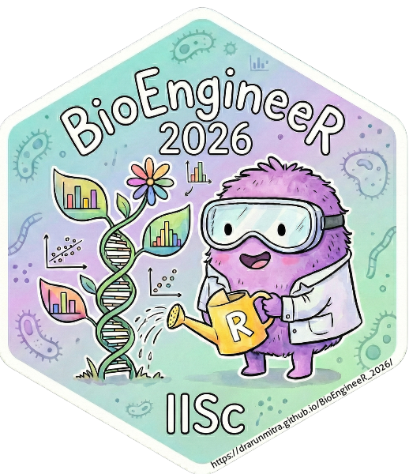

::: {.grid}

::: {.g-col-8}

## Welcome to BioEngineeR 2026! 🧬

A hands-on **3-day workshop** introducing R programming for biomedical data analysis, designed for researchers at the Department of Bioengineering, IISc Bangalore.

::: {.callout-note appearance="simple"}
## 📅 When & Where

**Dates:** 6th – 8th January 2026  
**Venue:** Department of Bioengineering, IISc Bangalore  
**Time:** 9:00 AM – 5:00 PM daily
:::

[📋 View Schedule](schedule.qmd){.btn .btn-primary} [🛠️ Set-up Guide](materials/prerequisites.qmd){.btn .btn-outline-primary}

:::

::: {.g-col-4}

{fig-align="center" width="100%"}

:::

:::

------------------------------------------------------------------------

## Topics Covered

### Day 1: R Foundations

- Introduction to Data Science using R
- Best Practices for Data Science (Reproducibility)
- Primer to R & RStudio
- Working with Data – I (Loading, Packages, Pipes, dplyr Verbs)
- Data Visualization – I (ggplot2 Defaults)

### Day 2: Statistics & Reporting

- Introduction to Quarto (Authoring Reports)
- Working with Data – II (Exploratory Data Analysis)
- Publication Ready Tables (gtsummary)
- Working with Data – III (Data Analysis Workflows)

### Day 3: Advanced Topics & AI

- Best Practices: Using AI for Data Science
- Data Visualization – II (Facets, Layouts, Themes, Extensions)
- Advanced R & Quarto
- Group Presentations & Feedback

------------------------------------------------------------------------

## Who Should Attend?

This workshop is ideal for:

- Researchers working with biomedical data
- Students interested in data analysis
- Lab members wanting to improve reproducibility
- Anyone curious about R – no prior experience required!

------------------------------------------------------------------------

## Contact

::: {.grid}

::: {.g-col-6}

### Resource Faculty

**Dr. Arun Mitra Peddireddy**  
All India Institute of Medical Sciences - Bibinagar, Hyderabad
📞 +91 9503563356  
📧 [dr.arunmitra@gmail.com](mailto:dr.arunmitra@gmail.com)

:::

::: {.g-col-6}

### Workshop Facilitator

**Shayana**  
📞 +91 9611564411  
Department of Bioengineering, IISc Bangalore

:::

:::

------------------------------------------------------------------------

## Venue

Department of Bioengineering, IISc Bangalore

::: {.content-visible when-format="html"}
<iframe src="https://www.google.com/maps/embed?pb=!1m18!1m12!1m3!1d3887.205422235134!2d77.56436599999999!3d13.0225867!2m3!1f0!2f0!3f0!3m2!1i1024!2i768!4f13.1!3m3!1m2!1s0x3bae175ddde7c0a5%3A0xb76e8f8e4aea7d5!2sDepartment%20of%20Bioengineering!5e0!3m2!1sen!2sin!4v1767445752453!5m2!1sen!2sin" width="100%" height="350" style="border:0; border-radius: 8px;" allowfullscreen="" loading="lazy" referrerpolicy="no-referrer-when-downgrade"></iframe>
:::

::: {.content-visible when-format="pdf"}
**Address:** Department of Bioengineering, Indian Institute of Science, Bangalore 560012, Karnataka, India
:::
